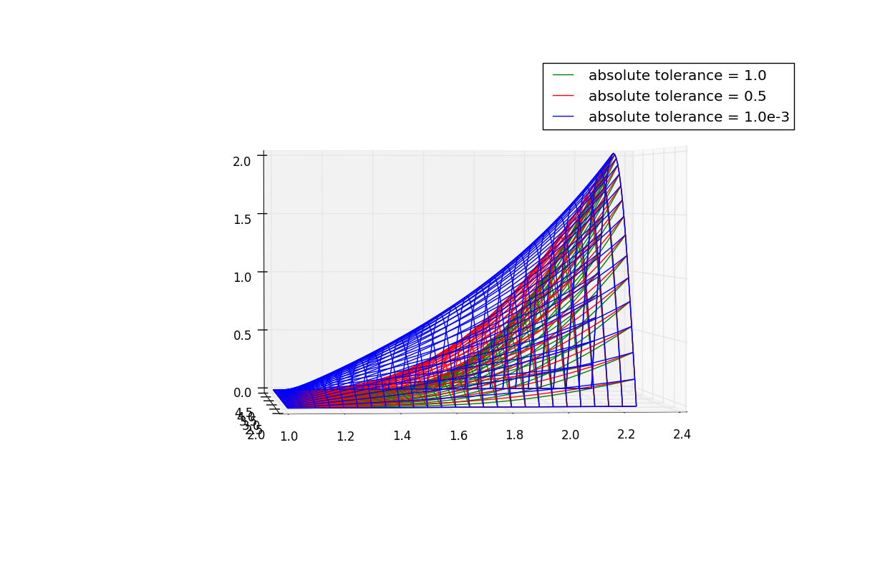
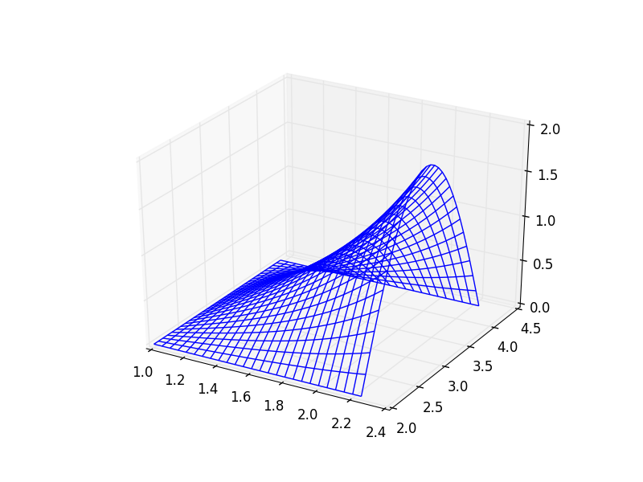
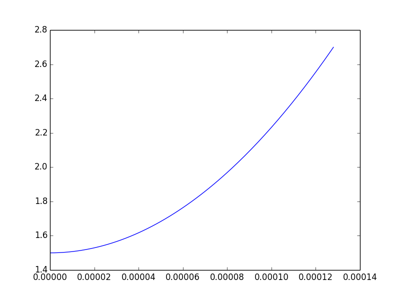

.. role:: raw-math(raw)
    :format: latex html

esPic
=======

Electrostatic particle-in-cell code.

Example: 2D Electrostatic, no particles
------------------

The 2d electrostatic example solves the 2d Laplace equation in the rectangle X0 < x < X0 + LX, Y0 < y < Y0 + LY, with (X0,Y0) = (1.0,2.0) m and (LX,LY) = (1.25,2.3) m.

The computational grid is 26 x 31, and the Dirichlet boundary conditions are V(0,y) = V(x,0) = V(x,LY) = 0 and V(LX,y) = 2.0 * sin(pi * y / LY) V. 

To run the 2d example, run the command

.. code-block:: bash

    $ python3 examples/ex_2d.py

The first plot should look like this, which shows 3 absolute error tolerances: 1.0, 0.5, and 0.001:

The second plot should look like this, which shows just the 0.001 absolute error tolerance.

Example: 1D Electrostatic, with particles
------------------

The 1d electrostatic example with particles shows the acceleration of an electron in a constant electric field.

This example solves the 1d Laplace equation for X0 < x < X0 + LX, with X0 = 1.5 m and LX = 1.2 m on a 20 point grid.

The Dirichlet boundary conditions are V(X0) = V0 and V(X0 + LX) = VN = V0 + dV, with V0 = 1.0 V and dV = 1.0e-3 V.

The particle is pushed, with no feedback on the potential, for N = 128 time steps of length DT = 1.0e-6 s.

To run the 1d example with particles, run the command

.. code-block:: bash

    $ python3 examples/ex_1d_particles.py

The following plots are generated, showing the position and velocity of the electron as a function of time:

.. image:: images/ex_1d_particles_velocity.png
    :align: center

We should expect the final speed of the electron to be e * dV * DT * N / (m * LX) = 18760.748 m/s, and the final position to be X0 + 0.5 * e * dV * (DT * N)^2 / (m * LX) = 2.701 m.

In this simulation, the final speed and position are 18751.407 m/s and 2.699 m, an error of 0.05% and 0.07%, respectively. 

Tests
------------------

To run the tests, run the script tests/testAll.sh.
